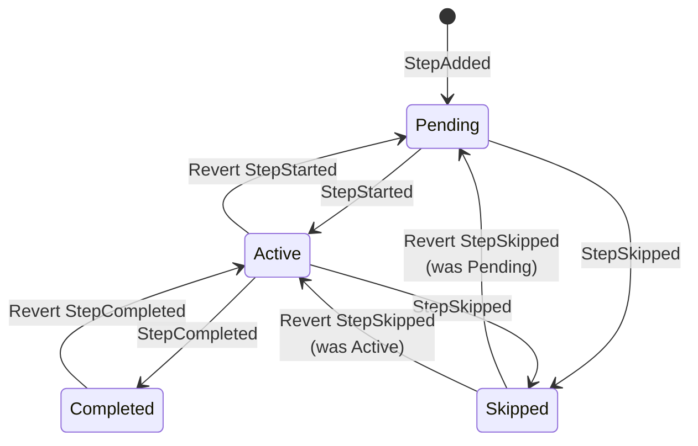

# Executions & Events

Procnote uses **event sourcing** to manage execution state. Every action the operator takes is recorded as an immutable event in an append-only log.

## What is an Execution?

An execution is a recorded instance of running a procedure template. It consists of:

- An **event log** (`events.jsonl`) -- the single source of truth
- A **template snapshot** -- the procedure as it was when the execution started
- **Attachments** -- any files uploaded during the execution

## Event Log

The event log is a JSONL file where each line is a JSON object representing one event. Events are appended sequentially and never modified or deleted.

Each event carries:

- A `type` discriminator (e.g., `StepStarted`, `CheckboxToggled`)
- An `at` timestamp (ISO 8601)
- An `execution_id`
- Event-specific payload fields

## Event Types

### Lifecycle Events

| Event | Description |
|-------|-------------|
| `ExecutionStarted` | Marks execution start; captures procedure ID, title, version |
| `ExecutionCompleted` | Execution finished with pass or fail status |
| `ExecutionAborted` | Execution stopped early with a reason |

### Step Events

| Event | Description |
|-------|-------------|
| `StepAdded` | A new step was added (from template or dynamically) |
| `StepStarted` | Operator began working on a step |
| `StepCompleted` | Step finished successfully |
| `StepSkipped` | Step skipped with a reason |

### Data Capture Events

| Event | Description |
|-------|-------------|
| `CheckboxToggled` | Checkbox checked or unchecked |
| `InputRecorded` | Measurement, text, or selection value recorded |
| `AttachmentAdded` | File attached (stored with SHA-256 hash) |
| `NoteAdded` | Note added to a step or to the execution |

### Metadata & Audit Events

| Event | Description |
|-------|-------------|
| `LogMeta` | First event; records schema version and tool version |
| `ExecutionRenamed` | Execution given a human-readable name |
| `EventReverted` | Marks a previous event as reverted |

## Step State Machine

Every step has a **status** that changes in response to events. The diagram below shows all valid transitions, including those caused by reverting events.

**Forward transitions** (triggered by operator actions):

| From | Event | To |
|------|-------|----|
| Pending | `StepStarted` | Active |
| Pending | `StepSkipped` | Skipped |
| Active | `StepCompleted` | Completed |
| Active | `StepSkipped` | Skipped |

**Revert transitions** (triggered by reverting a previous event):

| From | Reverted Event | To |
|------|----------------|----|
| Active | `StepStarted` | Pending |
| Completed | `StepCompleted` | Active |
| Skipped | `StepSkipped` | Pending (if step was never started) |
| Skipped | `StepSkipped` | Active (if step was started before being skipped) |

!!! info "Revert validation"
    Not every revert is allowed. For example, reverting a `StepStarted` event is rejected if a subsequent `StepCompleted` event depends on it. Procnote performs a **trial replay** to verify that the resulting state is valid before committing the revert.

## State Reconstruction

Execution state is never stored directly. It is always **reconstructed by replaying the event log**:

1. **First pass:** Collect all reverted event indices from `EventReverted` markers.
2. **Second pass:** Apply each non-reverted event to build the current state.

This means the app can crash at any point and recover perfectly by re-reading the log on restart.

## Reverting Events

Events are classified into three categories by revertibility:

| Category | Events | Can revert? |
|----------|--------|-------------|
| **Revertible** | Checkboxes, inputs, notes, step completion/skip, execution completion/abort, rename | Yes |
| **Not revertible** | ExecutionStarted, StepAdded, LogMeta | No |
| **Revert marker** | EventReverted (cannot itself be reverted) | No |

When an event is reverted:

1. The system validates the event is revertible and not already reverted.
2. A trial replay is performed to ensure the resulting state is valid.
3. An `EventReverted` marker is appended with the target event index and a reason.
4. The original event remains in the log -- nothing is deleted.

This preserves a complete audit trail: you can see what was done, what was undone, and why.
